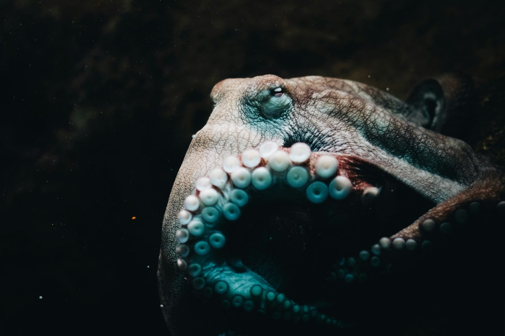
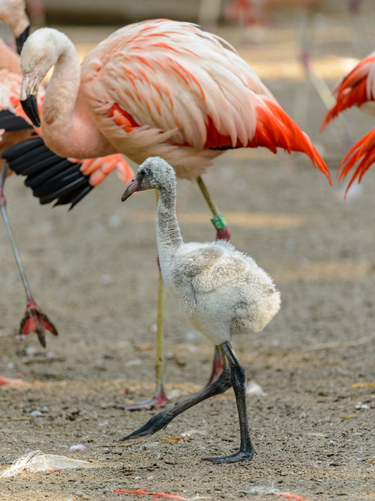
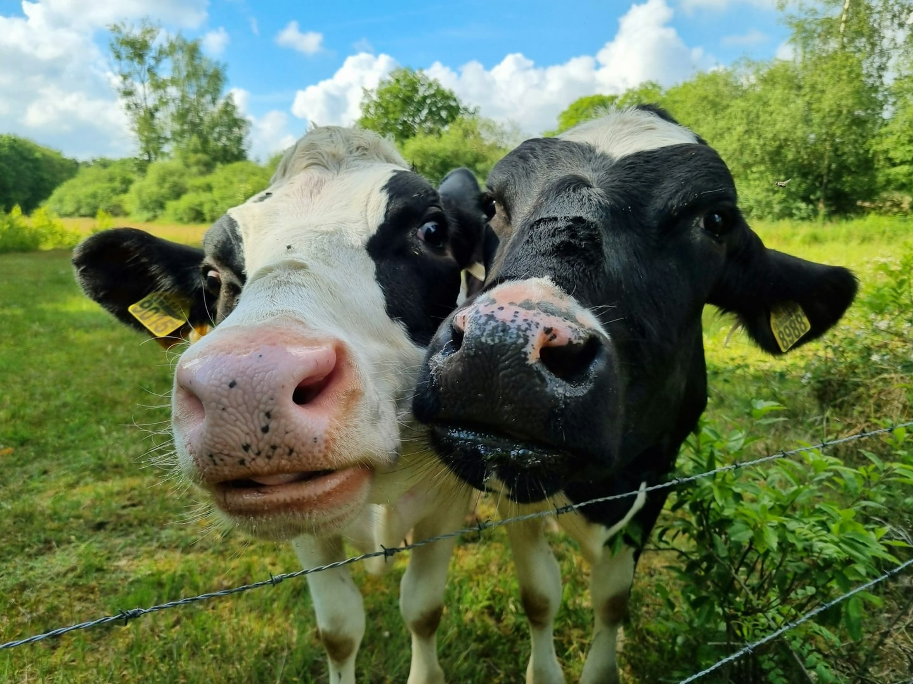

À l'école, on nous a appris que la vache fait « meuh » et que le flamant est rose. C'est un bon début, mais c'est un peu court. La nature cache des détails bien plus savoureux, et on est allés les chercher pour vous. Voici cinq pépites sur les animaux, toutes vérifiées, à ressortir sans modération au prochain dîner.

## 1. Les loutres de mer se tiennent la main pour dormir

Les loutres de mer dorment en flottant sur le dos. Le souci, quand on fait la sieste en pleine mer, c'est qu'on risque de se réveiller très loin des copines. Leur parade est sans doute la plus attendrissante du règne animal : elles se tiennent par la patte en dormant, pour ne pas dériver les unes loin des autres.

Petite précision, parce qu'au Filon on ne vous raconte pas d'histoires : la scène a surtout été filmée en aquarium. Dans la nature, elle reste rare, et les loutres préfèrent souvent s'enrouler dans les algues pour rester en place. Cela n'enlève rien au charme de l'image.

## 2. Le wombat fait des crottes en forme de cube

Oui, vous avez bien lu. Le wombat, ce marsupial tout en rondeurs venu d'Australie, produit des crottes cubiques. Pas vaguement carrées : de vrais petits cubes, avec des faces et des arêtes. C'est le genre d'information qu'on n'oublie plus jamais une fois qu'on l'a lue. De rien.

## 3. La pieuvre a trois cœurs et le sang bleu

Un seul cœur, c'est bon pour nous. La pieuvre, elle, en possède trois. Et comme si cela ne suffisait pas à la rendre fascinante, son sang n'est pas rouge mais bleu. Trois cœurs et du sang bleu : sur le papier, on dirait un personnage de science-fiction. En réalité, elle vit tranquillement au fond de nos océans.

## 4. Les flamants roses naissent gris

Le flamant rose ne mérite pas son nom à la naissance : les poussins viennent au monde tout gris. Leur célèbre couleur arrive plus tard, et elle vient directement de leur assiette. Ce sont les crevettes et les algues dont ils se nourrissent qui teintent peu à peu leur plumage. Le flamant est donc la preuve vivante que l'on est ce que l'on mange.

## 5. Les vaches ont une meilleure amie

On termine par notre préférée. Les vaches ne sont pas indifférentes à leurs voisines de pré : elles ont des affinités, et certaines ont une congénère préférée. Mieux encore, elles sont moins stressées quand cette amie est à leurs côtés.

Ce n'est pas une légende de campagne. C'est la conclusion d'un travail de recherche mené à l'université de Northampton, au Royaume-Uni, par Krista McLennan, dans une thèse soutenue en 2013. La chercheuse y a observé que le rythme cardiaque des vaches était plus bas lorsqu'elles se trouvaient avec leur partenaire préférée plutôt qu'avec une autre.

## Ce qu'on en retient

Des mains qui se cherchent dans le sommeil, des amitiés qui apaisent, des couleurs qui viennent du repas : les animaux nous ressemblent parfois plus qu'on ne le croit. Et quand ils ne nous ressemblent pas du tout, comme le wombat et ses cubes, c'est encore mieux.

La prochaine fois que vous croiserez une vache, pensez à saluer aussi sa meilleure amie.
