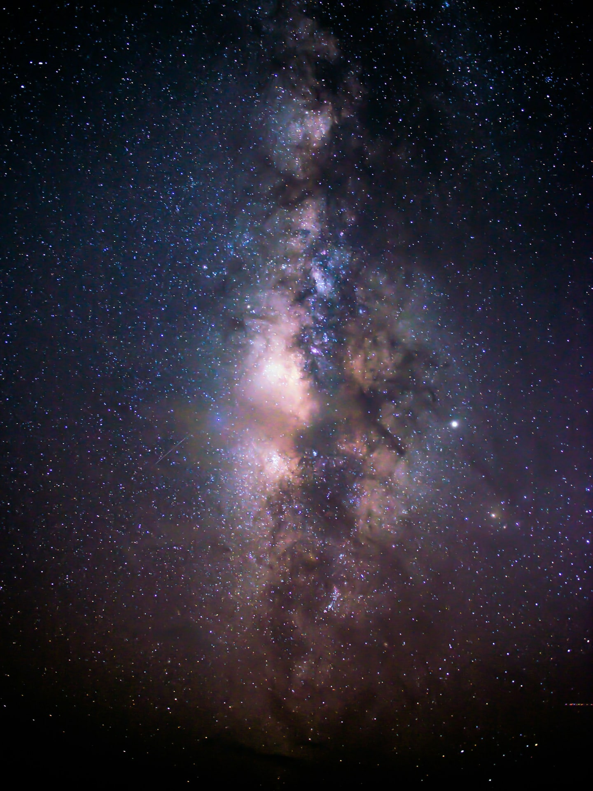
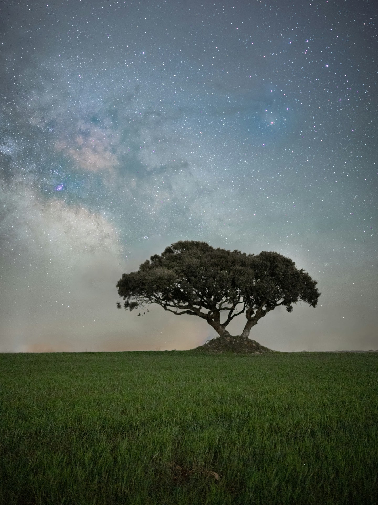

Levez les yeux par une belle nuit d'été, loin des lampadaires. Le ciel déborde d'étoiles, et on se sent tout petit. Maintenant, baissez les yeux vers la forêt la plus proche. Vous ne le devinez pas encore, mais c'est elle qui gagne le match.

Car c'est un fait, aussi vertigineux que vérifiable : il y a plus d'arbres sur notre planète que d'étoiles dans toute notre galaxie. Et pas qu'un peu.

## 3 000 milliards d'arbres, rien que ça

Commençons par les arbres. Combien y en a-t-il sur Terre ? La question paraît impossible, et pourtant des chercheurs s'y sont attaqués. Leur réponse a été publiée en 2015 dans la revue scientifique *Nature*, l'une des plus prestigieuses au monde, sous la plume de Thomas Crowther et de ses collègues.

Le résultat : environ 3 000 milliards d'arbres. Écrit en chiffres, cela donne un 3 suivi de douze zéros. C'est tellement grand que le cerveau décroche, alors gardons simplement l'ordre de grandeur en tête pour la suite.

## Et du côté des étoiles ?

Notre galaxie, la Voie lactée, n'est pas vraiment une petite joueuse. Elle abriterait entre 100 et 400 milliards d'étoiles. La fourchette est large, et c'est normal : compter des étoiles n'a rien d'un recensement de quartier, et les astronomes préfèrent donner une estimation basse et une estimation haute.

Entre 100 et 400 milliards, donc. C'est gigantesque. Mais vous voyez déjà où l'on veut en venir.

## On a refait le calcul

Soyons beaux joueurs et donnons toutes leurs chances aux étoiles, en retenant l'estimation la plus haute : 400 milliards.

- Arbres sur Terre : environ 3 000 milliards
- Étoiles dans la Voie lactée : jusqu'à 400 milliards

3 000 divisé par 400, cela fait 7,5. Autrement dit, même dans le scénario le plus favorable au ciel, on compte plus de 7 arbres pour chaque étoile de notre galaxie.

Et si l'on retient l'estimation basse, celle de 100 milliards d'étoiles, l'écart devient spectaculaire : 30 arbres par étoile.

## Pourquoi ce chiffre nous fait autant d'effet

Si ce chiffre surprend, c'est parce que notre intuition nous joue un tour. Le ciel étoilé est pour nous l'image même de l'infini, alors que les arbres font partie du décor. On en croise tous les jours, dans la rue, au parc, au bord de la route, sans jamais songer à les additionner.

Pourtant, c'est bien sous nos pieds, et non au-dessus de nos têtes, que se trouve la plus grande foule. Chaque étoile de la Voie lactée pourrait avoir sa petite forêt personnelle d'au moins sept arbres.

## Le chiffre à retenir

Plus de 7 arbres pour 1 étoile, au minimum. La prochaine fois que quelqu'un s'extasie devant un ciel étoilé, vous pourrez lui glisser, l'air de rien, que le vrai spectacle est peut-être juste derrière lui, les racines dans la terre.

Et si cela vous donne envie d'aller saluer un arbre, on ne vous jugera pas.
